# Pretty Fly — Schema & Architecture

> **Regenerated from live codebase: `load_data.py`, CSV headers, `dataset.py`, `db.py`, compute modules, and frontend.**

---

## Project Tree

```
/
├── backend/                       Flask API + compute (Python 3.10+)
│   ├── app.py                     Flask server (6 endpoints, port 5055)
│   ├── agent.py                   StockSense Agent (intent retrieval + Claude)
│   ├── db.py                      SQLAlchemy engine (SQLite default, PG opt)
│   ├── dataset.py                 Cached pandas DataFrame loader + date parsing
│   ├── load_data.py               20 CSV → SQL tables
│   ├── run.sh                     venv → seed DB → Flask
│   ├── requirements.txt           pandas, numpy, flask, flask-cors, sqlalchemy, ...
│   ├── .env.example               ANTHROPIC_API_KEY + DATABASE_URL template
│   ├── prettyfly.db               SQLite database (auto-generated)
│   └── compute/
│       ├── stocksense.py          Score engine (0–100 per variant)
│       ├── cashengine.py          Cash flow scenarios (3 strategies)
│       └── simulator.py           Backtest proof (train/test split)
│
├── frontend/                      Next.js 14 App Router (React 18, TS 5.6)
│   ├── next.config.mjs            API proxy rewrites → Flask :5055
│   └── app/
│       ├── layout.tsx             Root layout + Sidebar shell
│       ├── globals.css            Dark-theme CSS (~106 lines)
│       ├── page.tsx               Dashboard (/)
│       ├── inventory/page.tsx     StockSense grid (/inventory)
│       ├── scenarios/page.tsx     Cash Engine (/scenarios)
│       ├── simulator/page.tsx     Backtest (/simulator)
│       └── chat/page.tsx          StockSense Agent chat (/chat)
│   └── components/
│       ├── Sidebar.tsx
│       └── charts.ts
│   └── lib/
│       ├── api.ts                 Typed API client
│       ├── format.ts              GBP/number/date formatters
│       └── md.tsx                 Tiny markdown renderer
│
├── data/                          Source data — 20 CSVs + 1 JSON
├── stocksense/                    Static prototypes, reports & data scripts
│   ├── stocksense.html            Static StockSense dashboard
│   ├── stocksense_data.py         Data pipeline (score computation)
│   ├── stocksense_data.js         Pre-computed StockSense data
│   ├── deepdive.html              Deep-dive analytics dashboard
│   ├── report.html                Rendered HTML report
│   ├── WC idea.html               Strategic pitch document
│   ├── chart_data.js              Pre-computed chart data
│   ├── chart.min.js               Chart.js library (minified)
│   ├── explore.py                 Exploratory data analysis
│   ├── extract_charts.py          Chart data generator (17 charts)
│   └── validate.py                20 reconciliation rules
├── SCHEMA.md                      This file
├── PROJECT-SUMMARY.md             Project overview & run instructions
└── CODEBASE-INFO.md               Full codebase reference
```

---

## Architecture

```
Browser → Next.js :3010  ──(rewrite /api/*)──→  Flask :5055  ──(SQLAlchemy)──→  SQLite / Postgres
```

| Layer | Tech | Notes |
|---|---|---|
| Frontend | Next.js 14 (App Router, TypeScript) | Pure CSS dark theme, no Tailwind |
| Backend | Flask 3.0 + Flask-CORS 4.0 | `@lru_cache` on all compute functions |
| Database | SQLite (default) or PostgreSQL | Set `DATABASE_URL` for PG |
| Compute | pandas 2.0+, numpy 1.24+ | Memoized per-process, warmed at startup |
| LLM | Anthropic Claude (optional) | Falls back to grounded answers without key |
| Charts | Chart.js 4.4.8 + react-chartjs-2 5.2.0 | Dark palette in `charts.ts` |

---

## API Endpoints

| Method | Route | Source | Returns |
|---|---|---|---|
| GET | `/api/health` | `app.py` | `{ok, db, llm}` |
| GET | `/api/summary` | stocksense + cashengine + simulator | Dashboard rollup |
| GET | `/api/stocksense` | `compute/stocksense.py` | 645 scored variants + summary |
| GET | `/api/simulate` | `compute/simulator.py` | Backtest: `?cutoff=YYYY-MM-DD` |
| GET | `/api/cashengine` | `compute/cashengine.py` | Single scenario: `?scenario=conservative\|moderate\|aggressive` |
| GET | `/api/cashengine/all` | `compute/cashengine.py` | All three scenarios |
| POST | `/api/agent` | `agent.py` | `{answer, grounded, citations, used_llm}` body: `{question, use_llm}` |

---

## Frontend Pages

| Route | File | Description |
|---|---|---|
| `/` | `app/page.tsx` | Dashboard — KPI cards, cash position, recommendation queue, backtest summary |
| `/inventory` | `app/inventory/page.tsx` | StockSense grid — 645 SKUs filtered by status, type, search |
| `/scenarios` | `app/scenarios/page.tsx` | Cash Engine — scenario chips, KPI cards, comparison bar chart |
| `/simulator` | `app/simulator/page.tsx` | Backtest proof — cumulative chart, top reorder/markdown tables |
| `/chat` | `app/chat/page.tsx` | StockSense Agent — message history, 6 suggested questions, citation chips |

---

## Compute Engines

### StockSense (`backend/compute/stocksense.py`)
- **Formula:** `stock_urgency(0–50) + demand_intensity(0–30) + trend_bonus(0–20)` = score (0–100)
- **Input tables:** `orders`, `line_items`, `variants`, `products`, `po_line_items`
- **"Today"** = 1 June 2026
- **Velocities:** last-3-months (weight 0.6), last-12-months (weight 0.4)
- **Months cover** = inventory / blended_weekly_velocity / 4.33
- **Status rules:**
  - `reorder` — inventory ≤ 0, OR months_cover < 2 with velocity > 0
  - `markdown` — months_cover > 12 with velocity > 0, OR velocity = 0 with stock > 0
  - `watch` — score ≥ 50
  - `healthy` — everything else
- **Output per variant:** score, status, recommendation, recommendation_cost, recommendation_detail, sparkline (monthly), margin_pct

### Cash Engine (`backend/compute/cashengine.py`)
- **Input:** StockSense output (cached) + scenario config
- **Three scenarios:**

| Scenario | Discount | Sell-through | Reorder share |
|---|---|---|---|
| Conservative | 20% | 50% | 50% |
| Moderate | 30% | 70% | 80% |
| Aggressive | 40% | 85% | 100% |

- **Output:** trapped_cash, freed_cash, reorder_investment, fundable_reorder, projected_revenue_uplift, net_cash_position

### Simulator (`backend/compute/simulator.py`)
- **Method (no peeking):**
  1. Cutoff at month 12 (2025-05-31 default)
  2. Score variants using ONLY pre-cutoff data
  3. Emit recommendations at cutoff
  4. Replay months 13–24, measure actual outcomes
- **Input tables:** `orders`, `line_items`, `variants`, `products`, `po_line_items`, `inventory_movements`
- **Output:** headline totals, 12-month cumulative series, top reorder/markdown SKUs, methodology

### StockSense Agent (`backend/agent.py`)
- **6 intent skills:** `reorder_first`, `free_cash`, `supplier_leadtime`, `losing_on_storage`, `backtest`, `summary`
- Regex intent matching → grounded markdown + structured citations
- Optional Claude Haiku layer for natural phrasing (never invents data)

---

## Database Schema

**20 CSV tables loaded by `load_data.py`** into SQLite/Postgres.  
**1 additional JSON file** (`support_messages.json`) exists in `data/` but is NOT loaded as a DB table — it is referenced only as documentation.

### Entity Relationship Diagram

```mermaid
erDiagram
    products {
        string product_id PK
        string title
        string handle
        string description
        string product_type
        string vendor
        string collection
        string gender_segment
        string tags
        string status
        string created_at
    }
    variants {
        string variant_id PK
        string product_id FK
        string sku
        string option1_name
        string option1_value
        string option2_name
        string option2_value
        float price
        float compare_at_price
        string barcode
        int weight_grams
        int inventory_quantity
    }
    collections {
        string collection_id PK
        string title
        string created_at
    }
    product_collections {
        string product_id FK
        string collection_id FK
    }
    customers {
        string customer_id PK
        string email
        string first_name
        string last_name
        string created_at
        bool accepts_marketing
        float total_spent
        int orders_count
        string acquisition_source
        string acquisition_date
        string default_country
        string gender_segment_affinity
    }
    addresses {
        string customer_id FK
        string first_name
        string last_name
        string address1
        string address2
        string city
        string province
        string postcode
        string country
    }
    orders {
        string order_id PK
        string order_number
        string customer_id FK
        string created_at
        string currency
        float subtotal
        float total_discounts
        float total_shipping
        float total_tax
        float total_price
        string financial_status
        string fulfillment_status
        string utm_source
        string utm_medium
        string utm_campaign
        string landing_site
        string referring_site
        string tags
        string discount_code FK
    }
    line_items {
        string line_item_id PK
        string order_id FK
        string variant_id FK
        string product_id FK
        string title
        int quantity
        float price
        float total_discount
    }
    discount_codes {
        string code PK
        string type
        float value
        int usage_count
        string starts_at
        string ends_at
    }
    refunds {
        string refund_id PK
        string order_id FK
        string created_at
        float amount
        string reason
        string refund_line_items
    }
    suppliers {
        string supplier_id PK
        string name
        string country
        string payment_terms
        int lead_time_days
        string currency
    }
    purchase_orders {
        string po_id PK
        string supplier_id FK
        string created_at
        string expected_delivery
        string actual_delivery
        string status
        float total_cost_supplier_ccy
        float total_cost_gbp
        string deposit_paid_at
        string balance_paid_at
    }
    po_line_items {
        string po_line_id PK
        string po_id FK
        string variant_id FK
        int quantity_ordered
        int quantity_received
        float unit_cost_supplier_ccy
        float landed_cost_per_unit_gbp
    }
    inventory_movements {
        string movement_id PK
        string variant_id FK
        string date
        string type
        int quantity_delta
        int running_balance
        string reference_id FK
    }
    google_ads_daily {
        string date
        string campaign_name
        string campaign_type
        string ad_group
        int impressions
        int clicks
        float spend_gbp
        int conversions
        float conversion_value_gbp
    }
    meta_ads_daily {
        string date
        string campaign_name
        string campaign_objective
        string ad_set
        string ad_name
        string placement
        int impressions
        int clicks
        float spend_gbp
        int conversions
        float conversion_value_gbp
    }
    email_campaigns {
        string campaign_id PK
        string name
        string type
        string sent_at
        int recipients
        int opens
        int clicks
        int unsubscribes
        int attributed_orders
        float attributed_revenue_gbp
    }
    email_events {
        string event_id PK
        string campaign_id FK
        string customer_id FK
        string event_type
        string timestamp
    }
    support_tickets {
        string ticket_id PK
        string customer_id FK
        string created_at
        string channel
        string status
        string priority
        string category
        string subject
        string related_order_id FK
        string related_product_id FK
        string first_response_at
        string resolved_at
        int resolution_time_minutes
        int satisfaction_rating
        string resolved_by
    }
    bank_transactions {
        string transaction_id PK
        string date
        string description
        float amount_gbp
        float balance_gbp
        string counterparty
        string category
        string raw_category
    }

    products ||--o{ variants : "has"
    products ||--o{ product_collections : "belongs to"
    collections ||--o{ product_collections : "contains"
    customers ||--|| addresses : "has"
    customers ||--o{ orders : "places"
    orders ||--o{ line_items : "contains"
    orders ||--o{ refunds : "has"
    orders }o--|| discount_codes : "applies"
    line_items }o--|| variants : "references"
    line_items }o--|| products : "references"
    suppliers ||--o{ purchase_orders : "fulfills"
    purchase_orders ||--o{ po_line_items : "contains"
    po_line_items }o--|| variants : "orders"
    variants ||--o{ inventory_movements : "tracks"
    email_campaigns ||--o{ email_events : "generates"
    email_events }o--|| customers : "sent to"
    support_tickets }o--|| customers : "raised by"
    support_tickets }o--o| orders : "relates to"
    support_tickets }o--o| products : "relates to"
```



---

### Table Row Counts

| # | Table | Rows | # | Table | Rows |
|---|---|---|---|---|---|
| 1 | products | 62 | 11 | purchase_orders | 21 |
| 2 | variants | 645 | 12 | po_line_items | 645 |
| 3 | collections | 9 | 13 | inventory_movements | 76,444 |
| 4 | product_collections | 62 | 14 | google_ads_daily | 5,110 |
| 5 | customers | 22,440 | 15 | meta_ads_daily | 3,102 |
| 6 | addresses | 22,440 | 16 | email_campaigns | 6 |
| 7 | orders | 49,793 | 17 | email_events | 11,368 |
| 8 | line_items | 69,956 | 18 | support_tickets | 1,204 |
| 9 | discount_codes | 8 | 19 | bank_transactions | 560 |
| 10 | refunds | 5,843 | 20 | suppliers | 5 |

> **`support_messages.json`** (1,204 entries, one per ticket) exists in `data/` but is **not loaded as a DB table**. It contains JSON message threads per ticket and is not referenced by any compute module.

---

### FK Relationships

| From | FK Column | To | Join Key |
|---|---|---|---|
| `variants` | `product_id` | `products` | `product_id` |
| `product_collections` | `product_id` | `products` | `product_id` |
| `product_collections` | `collection_id` | `collections` | `collection_id` |
| `addresses` | `customer_id` | `customers` | `customer_id` |
| `orders` | `customer_id` | `customers` | `customer_id` |
| `orders` | `discount_code` | `discount_codes` | `code` |
| `line_items` | `order_id` | `orders` | `order_id` |
| `line_items` | `variant_id` | `variants` | `variant_id` |
| `line_items` | `product_id` | `products` | `product_id` |
| `refunds` | `order_id` | `orders` | `order_id` |
| `purchase_orders` | `supplier_id` | `suppliers` | `supplier_id` |
| `po_line_items` | `po_id` | `purchase_orders` | `po_id` |
| `po_line_items` | `variant_id` | `variants` | `variant_id` |
| `inventory_movements` | `variant_id` | `variants` | `variant_id` |
| `inventory_movements` | `reference_id` | `orders` / `purchase_orders` | `order_id` (sales) / `po_id` (receipts) |
| `email_events` | `campaign_id` | `email_campaigns` | `campaign_id` |
| `email_events` | `customer_id` | `customers` | `customer_id` |
| `support_tickets` | `customer_id` | `customers` | `customer_id` |
| `support_tickets` | `related_order_id` | `orders` | `order_id` |
| `support_tickets` | `related_product_id` | `products` | `product_id` |

### Soft Joins (string matching — no FK constraint)

| Table A | Column | Table B | Column | Purpose |
|---|---|---|---|---|
| `orders` | `utm_campaign` | `google_ads_daily` | `campaign_name` | Ad attribution |
| `orders` | `utm_campaign` | `meta_ads_daily` | `campaign_name` | Ad attribution |
| `orders` | `utm_campaign` | `email_campaigns` | `name` | Email attribution |
| `bank_transactions` | `description` | (various) | — | String pattern matching |
| `refunds` | `refund_line_items` | `variants` | `variant_id` | JSON array of variant IDs |

---

### Date Columns (parsed by `dataset.py`)

| Table | Date Columns |
|---|---|
| `orders` | `created_at` |
| `products` | `created_at` |
| `purchase_orders` | `created_at`, `expected_delivery`, `actual_delivery`, `deposit_paid_at`, `balance_paid_at` |
| `bank_transactions` | `date` |
| `inventory_movements` | `date` |
| `refunds` | `created_at` |
| `google_ads_daily` | `date` |
| `meta_ads_daily` | `date` |
| `email_campaigns` | `sent_at` |
| `email_events` | `timestamp` |
| `support_tickets` | `created_at`, `first_response_at`, `resolved_at` |
| `customers` | `created_at`, `acquisition_date` |

Tables _without_ date columns: `line_items`, `variants`, `collections`, `product_collections`, `addresses`, `discount_codes`, `suppliers`, `po_line_items`

---

### Data Domains (by business function)

```
┌──────────────┐    ┌──────────────┐    ┌──────────────┐
│   CATALOGUE  │    │   CUSTOMERS  │    │    ORDERS    │
│              │    │              │    │              │
│  products    │    │  customers   │    │  orders      │
│  variants    │    │  addresses   │    │  line_items  │
│  collections │    │              │    │  discount_   │
│  product_    │    └──────┬───────┘    │   codes      │
│   collections│           │            │  refunds     │
└──────┬───────┘           │            └──────┬───────┘
       │                   │                   │
       │    ┌──────────────┼───────────────────┘
       │    │              │
       ▼    ▼              ▼
┌──────────────┐    ┌──────────────┐    ┌──────────────┐
│    SUPPLY    │    │  MARKETING   │    │   SUPPORT    │
│    CHAIN     │    │              │    │              │
│              │    │ google_ads   │    │ support_     │
│ suppliers    │    │ meta_ads     │    │  tickets     │
│ purchase_    │    │ email_camp   │    │              │
│   orders     │    │ email_events │    │              │
│ po_line_     │    │              │    │              │
│   items      │    └──────┬───────┘    └──────────────┘
│ inventory_   │           │
│   movements  │           │
└──────────────┘           │ (utm_campaign)
                           ▼
                    ┌──────────────┐
                    │   BANKING    │
                    │              │
                    │ bank_trans   │
                    │  actions     │
                    └──────────────┘
```

---

## Compute Module Table Dependencies

Which tables each compute module actually reads:

| Module | Tables Used |
|---|---|
| `stocksense.py` | `orders`, `line_items`, `variants`, `products`, `po_line_items` |
| `cashengine.py` | (uses StockSense output, no direct DB reads) |
| `simulator.py` | `orders`, `line_items`, `variants`, `products`, `po_line_items`, `inventory_movements` |
| `agent.py` | (uses StockSense + Simulator output, no direct DB reads) |

Tables **loaded** into DB but **not read** by any compute module:
`collections`, `product_collections`, `customers`, `addresses`, `discount_codes`, `refunds`, `suppliers`, `purchase_orders`*, `google_ads_daily`, `meta_ads_daily`, `email_campaigns`, `email_events`, `support_tickets`, `bank_transactions`

> `*purchase_orders` is loaded but only `po_line_items` is read — `purchase_orders` is referenced indirectly via `po_line_items.po_id`.

---

## Data Reconciliation (`validate.py`)

20 rules ensure internal consistency. Run with: `python stocksense/validate.py`

| # | Rule | Key Tables |
|---|---|---|
| 1 | Order subtotals = sum of line items | orders, line_items |
| 2 | Customer total_spent + orders_count match orders | customers, orders |
| 3 | Discount code usage_count = orders using that code | discount_codes, orders |
| 4 | Every sale produces inventory movement | line_items, inventory_movements |
| 5 | Every PO receipt produces inventory movement | po_line_items, inventory_movements |
| 6 | Every refund → inventory return + bank txn | refunds, inventory_movements, bank_transactions |
| 7 | Inventory movements sum to current stock | inventory_movements, variants |
| 8 | Monthly Google ad spend = Google bank transactions | google_ads_daily, bank_transactions |
| 9 | Monthly Meta ad spend = Meta bank transactions | meta_ads_daily, bank_transactions |
| 10 | UTM campaign names in orders exist in ads/email | orders, google/meta ads, email_campaigns |
| 11 | Email attributed orders/revenue match orders | email_campaigns, orders |
| 12 | Klaviyo subscription appears in bank | bank_transactions |
| 13 | PO deposits + balances = total_cost | purchase_orders, bank_transactions |
| 14 | Running bank balance internally consistent | bank_transactions |
| 15 | Net Sales = subtotals - discounts - refunds | orders, refunds |
| 16 | COGS = sum(units sold × landed cost) | line_items, po_line_items |
| 17 | Inventory value = quantity × landed cost | variants, po_line_items |
| 18 | Accounts Payable = outstanding PO balances | purchase_orders |
| 19 | Support ticket FKs all exist | support_tickets, customers, orders, products |
| 20 | UTM campaign names consistent across tables | orders, google/meta ads, email_campaigns |

---

## Cache Strategy

| Layer | Mechanism | Invalidation |
|---|---|---|
| Compute functions | `@lru_cache(maxsize=N)` | Process restart |
| Dataset loader | `@lru_cache(maxsize=None)` | `dataset.invalidate()` or restart |
| Warm-up | `app.py` calls compute at startup | — |
| Frontend | None (fetches on each mount) | — |

---

## How to Run

```bash
# Backend (port 5055)
cd backend && bash run.sh          # creates venv, seeds DB, starts Flask

# Frontend (port 3010)
cd frontend && npm install && npm run dev
# Open http://localhost:3010
```

---

## Environment Variables

```
# backend/.env (both optional)
ANTHROPIC_API_KEY=sk-ant-...       # Enables Claude LLM in StockSense Agent
DATABASE_URL=postgresql://...      # Switches to PostgreSQL instead of SQLite
```
