# Pretty Fly Data Schema - Entity Relationship Diagram

```mermaid
erDiagram
    %% ── CATALOGUE ──
    products {
        string product_id PK
        string title
        string handle
        string description
        string product_type
        string vendor
        string collection
        string gender_segment
        string tags
        string status
        string created_at
    }

    variants {
        string variant_id PK
        string product_id FK
        string sku
        string option1_name
        string option1_value
        string option2_name
        string option2_value
        float price
        float compare_at_price
        string barcode
        int weight_grams
        int inventory_quantity
    }

    collections {
        string collection_id PK
        string title
        string created_at
    }

    product_collections {
        string product_id FK
        string collection_id FK
    }

    %% ── CUSTOMERS & ADDRESSES ──
    customers {
        string customer_id PK
        string email
        string first_name
        string last_name
        string created_at
        bool accepts_marketing
        float total_spent
        int orders_count
        string acquisition_source
        string acquisition_date
        string default_country
        string gender_segment_affinity
    }

    addresses {
        string customer_id FK
        string first_name
        string last_name
        string address1
        string address2
        string city
        string province
        string postcode
        string country
    }

    %% ── ORDERS & LINE ITEMS ──
    orders {
        string order_id PK
        string order_number
        string customer_id FK
        string created_at
        string currency
        float subtotal
        float total_discounts
        float total_shipping
        float total_tax
        float total_price
        string financial_status
        string fulfillment_status
        string utm_source
        string utm_medium
        string utm_campaign FK
        string landing_site
        string referring_site
        string tags
        string discount_code FK
    }

    line_items {
        string line_item_id PK
        string order_id FK
        string variant_id FK
        string product_id FK
        string title
        int quantity
        float price
        float total_discount
    }

    discount_codes {
        string code PK
        string type
        float value
        int usage_count
        string starts_at
        string ends_at
    }

    refunds {
        string refund_id PK
        string order_id FK
        string created_at
        float amount
        string reason
        string refund_line_items
    }

    %% ── INVENTORY & SUPPLY CHAIN ──
    suppliers {
        string supplier_id PK
        string name
        string country
        string payment_terms
        int lead_time_days
        string currency
    }

    purchase_orders {
        string po_id PK
        string supplier_id FK
        string created_at
        string expected_delivery
        string actual_delivery
        string status
        float total_cost_supplier_ccy
        float total_cost_gbp
        string deposit_paid_at
        string balance_paid_at
    }

    po_line_items {
        string po_line_id PK
        string po_id FK
        string variant_id FK
        int quantity_ordered
        int quantity_received
        float unit_cost_supplier_ccy
        float landed_cost_per_unit_gbp
    }

    inventory_movements {
        string movement_id PK
        string variant_id FK
        string date
        string type
        int quantity_delta
        int running_balance
        string reference_id FK
    }

    %% ── MARKETING: ADS ──
    google_ads_daily {
        string date
        string campaign_name
        string campaign_type
        string ad_group
        int impressions
        int clicks
        float spend_gbp
        int conversions
        float conversion_value_gbp
    }

    meta_ads_daily {
        string date
        string campaign_name
        string campaign_objective
        string ad_set
        string ad_name
        string placement
        int impressions
        int clicks
        float spend_gbp
        int conversions
        float conversion_value_gbp
    }

    %% ── MARKETING: EMAIL ──
    email_campaigns {
        string campaign_id PK
        string name
        string type
        string sent_at
        int recipients
        int opens
        int clicks
        int unsubscribes
        int attributed_orders
        float attributed_revenue_gbp
    }

    email_events {
        string event_id PK
        string campaign_id FK
        string customer_id FK
        string event_type
        string timestamp
    }

    %% ── SUPPORT ──
    support_tickets {
        string ticket_id PK
        string customer_id FK
        string created_at
        string channel
        string status
        string priority
        string category
        string subject
        string related_order_id FK
        string related_product_id FK
        string first_response_at
        string resolved_at
        int resolution_time_minutes
        int satisfaction_rating
        string resolved_by
    }

    support_messages {
        string ticket_id FK
        string json_messages
    }

    %% ── BANKING ──
    bank_transactions {
        string transaction_id PK
        string date
        string description
        float amount_gbp
        float balance_gbp
        string counterparty
        string category
        string raw_category
    }

    %% ────────────────────────────────────────────
    %% RELATIONSHIPS
    %% ────────────────────────────────────────────

    %% Catalogue
    products ||--o{ variants : "has variants"
    products ||--o{ product_collections : "belongs to"
    collections ||--o{ product_collections : "contains"

    %% Customers
    customers ||--|| addresses : "has address"
    customers ||--o{ orders : "places"

    %% Orders
    orders ||--o{ line_items : "contains"
    orders ||--o{ refunds : "has"
    orders }o--|| discount_codes : "applies"

    %% Line Items → Products & Variants
    line_items }o--|| variants : "references"
    line_items }o--|| products : "references"

    %% Supply Chain
    suppliers ||--o{ purchase_orders : "fulfills"
    purchase_orders ||--o{ po_line_items : "contains"
    po_line_items }o--|| variants : "orders"

    %% Inventory
    variants ||--o{ inventory_movements : "tracks"
    inventory_movements }o--|| orders : "sale/return"

    %% Marketing Attribution
    orders }o--o| google_ads_daily : "utm_campaign joins"
    orders }o--o| meta_ads_daily : "utm_campaign joins"

    %% Email
    email_campaigns ||--o{ email_events : "generates"
    email_events }o--|| customers : "sent to"
    orders }o--o| email_campaigns : "utm_campaign joins"

    %% Support
    support_tickets }o--|| customers : "raised by"
    support_tickets }o--o| orders : "relates to"
    support_tickets }o--o| products : "relates to"
    support_tickets ||--o{ support_messages : "contains"

    %% Banking (standalone - reconciled via validation rules)
    bank_transactions }o--o| suppliers : "reconciles to"
```



## Table Relationship Reference

| From Table | FK Column | To Table | Join Key |
|---|---|---|---|
| `variants` | `product_id` | `products` | `product_id` |
| `product_collections` | `product_id` | `products` | `product_id` |
| `product_collections` | `collection_id` | `collections` | `collection_id` |
| `addresses` | `customer_id` | `customers` | `customer_id` |
| `orders` | `customer_id` | `customers` | `customer_id` |
| `orders` | `discount_code` | `discount_codes` | `code` |
| `line_items` | `order_id` | `orders` | `order_id` |
| `line_items` | `variant_id` | `variants` | `variant_id` |
| `line_items` | `product_id` | `products` | `product_id` |
| `refunds` | `order_id` | `orders` | `order_id` |
| `purchase_orders` | `supplier_id` | `suppliers` | `supplier_id` |
| `po_line_items` | `po_id` | `purchase_orders` | `po_id` |
| `po_line_items` | `variant_id` | `variants` | `variant_id` |
| `inventory_movements` | `variant_id` | `variants` | `variant_id` |
| `inventory_movements` | `reference_id` | `orders` | `order_id` (sales/returns) |
| `inventory_movements` | `reference_id` | `purchase_orders` | `po_id` (receipts) |
| `email_events` | `campaign_id` | `email_campaigns` | `campaign_id` |
| `email_events` | `customer_id` | `customers` | `customer_id` |
| `support_tickets` | `customer_id` | `customers` | `customer_id` |
| `support_tickets` | `related_order_id` | `orders` | `order_id` |
| `support_tickets` | `related_product_id` | `products` | `product_id` |
| `support_messages` | `ticket_id` | `support_tickets` | `ticket_id` |

## Soft Joins (string matching, not FK)

| Table A | Column | Table B | Column | Notes |
|---|---|---|---|---|
| `orders` | `utm_campaign` | `google_ads_daily` | `campaign_name` | Marketing attribution |
| `orders` | `utm_campaign` | `meta_ads_daily` | `campaign_name` | Marketing attribution |
| `orders` | `utm_campaign` | `email_campaigns` | `name` | Email attribution |
| `bank_transactions` | `description` | (various) | — | Matched via string patterns (SHOPIFY, GOOGLE ADS, etc.) |
| `refunds` | `refund_line_items` | `variants` | `variant_id` | JSON array of variant IDs |

## Data Domains

```
┌──────────────┐    ┌──────────────┐    ┌──────────────┐
│   CATALOGUE  │    │   CUSTOMERS  │    │    ORDERS    │
│              │    │              │    │              │
│  products    │    │  customers   │    │  orders      │
│  variants    │    │  addresses   │    │  line_items  │
│  collections │    │              │    │  discount_   │
│  product_    │    └──────┬───────┘    │   codes      │
│   collections│           │            │  refunds     │
└──────┬───────┘           │            └──────┬───────┘
       │                   │                   │
       │    ┌──────────────┼───────────────────┘
       │    │              │
       ▼    ▼              ▼
┌──────────────┐    ┌──────────────┐    ┌──────────────┐
│    SUPPLY    │    │  MARKETING   │    │   SUPPORT    │
│    CHAIN     │    │              │    │              │
│              │    │ google_ads   │    │ support_     │
│ suppliers    │    │ meta_ads     │    │  tickets     │
│ purchase_    │    │ email_camp   │    │ support_     │
│   orders     │    │ email_events │    │  messages    │
│ po_line_     │    │              │    │              │
│   items      │    └──────┬───────┘    └──────────────┘
│ inventory_   │           │
│   movements  │           │ (utm_campaign)
└──────────────┘           │
                           ▼
                    ┌──────────────┐
                    │   BANKING    │
                    │              │
                    │ bank_trans   │
                    │  actions     │
                    └──────────────┘
```
